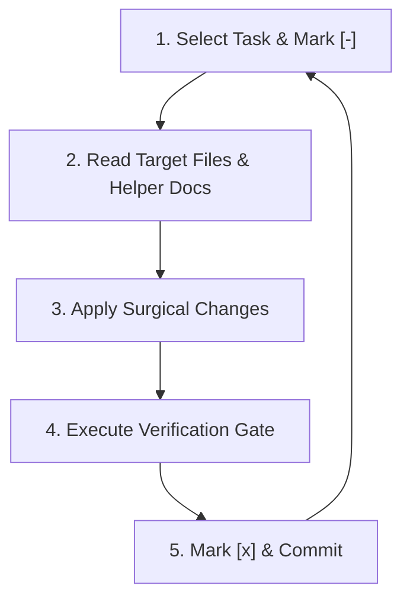

# Agent Task Tracker & Implementation Runner
**Project:** `tautos-bukiausias` (Lithuanian TV3 Parody Voting SPA)  
**Reference Spec:** [`docs/tasks.md`](file:///d:/Workplace/_FastSimple/tautos-bukiausias/docs/tasks.md)  
**Standard:** Vanilla ES2022+, Zero AI Slop, Emil Kowalski Motion, WCAG 2.1 AA

---

## Agent Autonomous Loop Protocol

Any agent executing tasks from this backlog must follow this deterministic 5-step loop:



### Protocol Rules:
1. **Status Legend:**
   - `[ ]` Pending
   - `[-]` In Progress
   - `[x]` Completed & Verified
   - `[!]` Blocked / Needs Human Review
2. **Batch Sequencing:** Complete and verify all tasks in Batch $N$ before picking tasks from Batch $N+1$.
3. **No Speculative Bloat:** Do not introduce bundlers (Vite/Webpack), npm dependencies, or UI frameworks.
4. **Preserve Show Identity:** Preserve all Lithuanian copy, satire, and character bios.
5. **Atomic Commits:** When running git commits, use Conventional Commits: `fix(security):`, `feat(a11y):`, `refactor(state):`, `perf(ui):`.

---

## Progress Summary

| Batch | Description | Tasks | Completed | Status |
| :--- | :--- | :---: | :---: | :---: |
| **Batch 1** | Critical Security & Firestore Hardening | 4 | 4 / 4 | `[x]` Completed |
| **Batch 2** | Concurrency, State & Network Resilience | 4 | 4 / 4 | `[x]` Completed |
| **Batch 3** | UI Performance & Event Delegation | 2 | 2 / 2 | `[x]` Completed |
| **Batch 4** | WCAG 2.1 AA Accessibility & UX Polish | 7 | 0 / 7 | `[ ]` Pending |
| **Total** | | **17** | **10 / 17** | **59%** |

---

## Detailed Task Backlog

### Batch 1: Critical Security & Firestore Hardening
*Agent Helper Docs:* [`docs/agents/security.md`](file:///d:/Workplace/_FastSimple/tautos-bukiausias/docs/agents/security.md), [`docs/agents/stack.md`](file:///d:/Workplace/_FastSimple/tautos-bukiausias/docs/agents/stack.md)

- [x] **Task 1.1: Firestore Rules & Deployment Lockdown**
  - **Files:** [`firestore.rules`](file:///d:/Workplace/_FastSimple/tautos-bukiausias/firestore.rules), [`deploy-firebase.ps1`](file:///d:/Workplace/_FastSimple/tautos-bukiausias/deploy-firebase.ps1)
  - **Goal:** Deny all collections by default. Scope write permissions strictly to `/voting/state` with schema validation (`votes` is map, `customContestants` is list $\le 50$, `voterLedger` is list $\le 100$, `updatedAt` is int). Update deploy script to include `firestore:rules`.
  - **Verification:** Validated syntax and schema with `firebase_validate_security_rules` (0 errors).
  - **Agent Log:** Completed 2026-09-11. Strict schema rules enforced on /voting/state; default deny-all active.

- [x] **Task 1.2: Eliminate Public Destructive Cloud Reset Button**
  - **Files:** [`index.html`](file:///d:/Workplace/_FastSimple/tautos-bukiausias/index.html), [`src/main.js`](file:///d:/Workplace/_FastSimple/tautos-bukiausias/src/main.js)
  - **Goal:** Remove `#resetDataBtn` from footer in `index.html`. Remove the click handler calling `pushCloudState()` from `main.js`. Retain local debug reset in console only.
  - **Verification:** `#resetDataBtn` removed from DOM; `window.__TAUTOS_DEBUG__.resetLocal` configured strictly for local debug.
  - **Agent Log:** Completed 2026-09-11. Public cloud reset eliminated.

- [x] **Task 1.3: Stored XSS Eradication & Input Sanitization**
  - **Files:** [`src/ui/activity.js`](file:///d:/Workplace/_FastSimple/tautos-bukiausias/src/ui/activity.js), [`src/ui/contestants.js`](file:///d:/Workplace/_FastSimple/tautos-bukiausias/src/ui/contestants.js), [`src/ui/leaderboard.js`](file:///d:/Workplace/_FastSimple/tautos-bukiausias/src/ui/leaderboard.js), [`src/ui/modal.js`](file:///d:/Workplace/_FastSimple/tautos-bukiausias/src/ui/modal.js)
  - **Goal:** Wrap `c.avatar` with `escapeHTML(c.avatar)` in all 3 rendering components. Escape candidate `id` fallbacks and attribute `data-id`. Whitelist emojis in modal handler and bound string lengths.
  - **Verification:** Syntax checked with `node --check`. All avatar outputs and data attributes sanitized with `escapeHTML`. Input lengths bounded (name 40, alias 40, tagline 100) and emoji whitelist enforced.
  - **Agent Log:** Completed 2026-09-11. XSS injection vectors closed.

- [x] **Task 1.4: Security Headers, CSP & Gitignore Hardening**
  - **Files:** [`firebase.json`](file:///d:/Workplace/_FastSimple/tautos-bukiausias/firebase.json), [`.gitignore`](file:///d:/Workplace/_FastSimple/tautos-bukiausias/.gitignore)
  - **Goal:** Add CSP headers (scripts: `'self'`, `https://www.gstatic.com`, `https://cdn.jsdelivr.net`), `X-Content-Type-Options`, `X-Frame-Options`. Add `package.json`, `skills-lock.json`, `firestore.rules`, `docs/**` to `"ignore"`. Append `.env*`, `*serviceAccount*.json` to `.gitignore`.
  - **Verification:** JSON validity verified with node. CSP, nosniff, DENY, and strict-origin headers configured in `firebase.json`. Secret patterns appended to `.gitignore`.
  - **Agent Log:** Completed 2026-09-11. Security headers and gitignore hardened.

---

### Batch 2: Concurrency, State Integrity & Network Resilience
*Agent Helper Docs:* [`docs/agents/best-practices.md`](file:///d:/Workplace/_FastSimple/tautos-bukiausias/docs/agents/best-practices.md), [`docs/agents/conventions.md`](file:///d:/Workplace/_FastSimple/tautos-bukiausias/docs/agents/conventions.md)

- [x] **Task 2.1: Robust State Merge Strategies & Dead State Cleanup**
  - **Files:** [`src/state/store.js`](file:///d:/Workplace/_FastSimple/tautos-bukiausias/src/state/store.js)
  - **Goal:** Remove unused `isSyncing` to stop double re-renders. Use `Math.max` when merging votes. Deduplicate ledger items by signature. In `hydrateFromLocalStorage()`, merge `DEFAULT_CONTESTANTS` with saved `custom` contestants only.
  - **Verification:** State merge tested with Math.max vote counts, signature deduplication on ledger, and safe custom contestant hydration.
  - **Agent Log:** Completed 2026-09-11. Removed isSyncing/setSyncing to eliminate 2 spurious re-renders per vote. Concurrency merge with Math.max prevents vote drops; ledger entries deduplicated; DEFAULT_CONTESTANTS preserved on hydration.

- [x] **Task 2.2: Resilient Dynamic SDK Import for Offline Fallback**
  - **Files:** [`src/services/api.js`](file:///d:/Workplace/_FastSimple/tautos-bukiausias/src/services/api.js)
  - **Goal:** Replace static CDN `import` with dynamic `import()` wrapped in `try...catch`. Add `window.addEventListener('online', ...)` sync trigger.
  - **Verification:** Dynamic import() wrapper catches network failure cleanly; app evaluates and loads from localStorage when offline. online event listener restores live sync.
  - **Agent Log:** Completed 2026-09-11. Firebase SDK converted to lazy dynamic import with graceful fallback and window 'online' sync reconnection.

- [x] **Task 2.3: Deprecate Legacy REST Constants & Unused Exports**
  - **Files:** [`src/config/constants.js`](file:///d:/Workplace/_FastSimple/tautos-bukiausias/src/config/constants.js), [`src/services/api.js`](file:///d:/Workplace/_FastSimple/tautos-bukiausias/src/services/api.js), [`src/main.js`](file:///d:/Workplace/_FastSimple/tautos-bukiausias/src/main.js), [`docs/agents/`](file:///d:/Workplace/_FastSimple/tautos-bukiausias/docs/agents/)
  - **Goal:** Remove `CLOUD_SYNC_URL` and `CLOUD_SYNC_INTERVAL_MS`. Remove unused `fetchCloudState()` export. Update documentation to reference Firestore only.
  - **Verification:** `grep -rn "CLOUD_SYNC_URL" src/` returns 0 results. fetchCloudState and CLOUD_SYNC_INTERVAL_MS removed.
  - **Agent Log:** Completed 2026-09-11. REST API constants and unused fetchCloudState export eliminated. Agent docs updated to reference Firestore.

- [x] **Task 2.4: Vote Submission Rate-Limiting / Cooldown**
  - **Files:** [`src/main.js`](file:///d:/Workplace/_FastSimple/tautos-bukiausias/src/main.js), [`src/ui/dock.js`](file:///d:/Workplace/_FastSimple/tautos-bukiausias/src/ui/dock.js)
  - **Goal:** Add 5s client submission cooldown in `sessionStorage`. Disable `#submitVoteBtn` during submission with visual feedback ("Balsuojama...").
  - **Verification:** 5000ms cooldown enforced via sessionStorage; submit button disabled and reflects "Balsuojama..." during cloud push.
  - **Agent Log:** Completed 2026-09-11. Rate limiting prevents double-clicks and rapid script submission.

---

### Batch 3: UI Performance & Event Delegation
*Agent Helper Docs:* [`docs/agents/ui-ux.md`](file:///d:/Workplace/_FastSimple/tautos-bukiausias/docs/agents/ui-ux.md), [`docs/agents/theming.md`](file:///d:/Workplace/_FastSimple/tautos-bukiausias/docs/agents/theming.md)

- [x] **Task 3.1: Event Delegation in Contestants Grid**
  - **Files:** [`src/ui/contestants.js`](file:///d:/Workplace/_FastSimple/tautos-bukiausias/src/ui/contestants.js)
  - **Goal:** Replace per-card `addEventListener` calls with a single delegated click/keydown listener on `#contestantsGrid`.
  - **Verification:** Toggling candidate cards works seamlessly. No listener accumulation.
  - **Agent Log:** Completed 2026-09-11. Replaced per-card click and keydown listeners with idempotent delegated listeners on #contestantsGrid.

- [x] **Task 3.2: Search Debounce & Render View Isolation**
  - **Files:** [`src/main.js`](file:///d:/Workplace/_FastSimple/tautos-bukiausias/src/main.js), [`src/ui/render.js`](file:///d:/Workplace/_FastSimple/tautos-bukiausias/src/ui/render.js), [`src/ui/leaderboard.js`](file:///d:/Workplace/_FastSimple/tautos-bukiausias/src/ui/leaderboard.js)
  - **Goal:** Debounce search input by 150ms. In `render.js`, only render `renderChart` when `standingsView === "chart"` and `renderLeaderboard` when `standingsView === "list"`. Decouple chart visibility logic from `leaderboard.js`.
  - **Verification:** Fast typing in search bar triggers only 1 render pass after typing pauses. View switching isolates Chart.js and list renders cleanly.
  - **Agent Log:** Completed 2026-09-11. Search input debounced by 150ms. View switcher visibility decoupled into render.js; renderChart and renderLeaderboard called conditionally based on active standingsView.

---

### Batch 4: WCAG 2.1 AA Accessibility & Polish
*Agent Helper Docs:* [`docs/agents/ui-ux.md`](file:///d:/Workplace/_FastSimple/tautos-bukiausias/docs/agents/ui-ux.md), [`AGENTS.md`](file:///d:/Workplace/_FastSimple/tautos-bukiausias/AGENTS.md)

- [ ] **Task 4.1: Semantic HTML Landmarks & Heading Hierarchy**
  - **Files:** [`index.html`](file:///d:/Workplace/_FastSimple/tautos-bukiausias/index.html)
  - **Goal:** Wrap content sections inside `<main id="main-content">`. Add `<a href="#main-content" class="sr-only">Praleisti į turinį</a>`. Change activity section `<h3>` heading to `<h2>`.
  - **Verification:** Screen reader landmark inspection displays `header`, `main`, `footer`. Headings outline: `h1` -> `h2`.
  - **Agent Log:**

- [ ] **Task 4.2: Accessible Card Labels, Filter States & Mobile Form Controls**
  - **Files:** [`src/ui/contestants.js`](file:///d:/Workplace/_FastSimple/tautos-bukiausias/src/ui/contestants.js), [`src/main.js`](file:///d:/Workplace/_FastSimple/tautos-bukiausias/src/main.js), [`index.html`](file:///d:/Workplace/_FastSimple/tautos-bukiausias/index.html)
  - **Goal:** Expand card `aria-label` to include `alias` and `tagline`. Add `aria-pressed` to `.filter-pill` buttons. Add `aria-label` and `aria-required="true"` to `#voterNameInput`.
  - **Verification:** Inspect accessibility tree in DevTools. Card label includes character satire bio.
  - **Agent Log:**

- [ ] **Task 4.3: Focus Contrast & Keyboard Trap Elimination**
  - **Files:** [`styles/tokens.css`](file:///d:/Workplace/_FastSimple/tautos-bukiausias/styles/tokens.css), [`styles/components/contestants.css`](file:///d:/Workplace/_FastSimple/tautos-bukiausias/styles/components/contestants.css), [`styles/components/scroll-top.css`](file:///d:/Workplace/_FastSimple/tautos-bukiausias/styles/components/scroll-top.css)
  - **Goal:** Replace 20% alpha focus shadows with `outline: 2px solid var(--color-gold); outline-offset: 2px;` on `:focus-visible`. Add `visibility: hidden;` to `.scroll-to-top-btn` when not visible.
  - **Verification:** Tab through page. Focus outline is clear and high-contrast. Tab never stops on invisible scroll-to-top button.
  - **Agent Log:**

- [ ] **Task 4.4: Modal Focus Management & Disabled Card Feedback**
  - **Files:** [`src/ui/modal.js`](file:///d:/Workplace/_FastSimple/tautos-bukiausias/src/ui/modal.js), [`styles/components/contestants.css`](file:///d:/Workplace/_FastSimple/tautos-bukiausias/styles/components/contestants.css), [`src/ui/contestants.js`](file:///d:/Workplace/_FastSimple/tautos-bukiausias/src/ui/contestants.js)
  - **Goal:** Trap Tab inside modal dialog and restore focus to trigger button on close. Remove `pointer-events: none` on `.disabled` cards to allow limit feedback toast ("Daugiausiai galima pasirinkti 3 kandidatus!").
  - **Verification:** Opening modal traps focus. Clicking 4th candidate triggers error toast.
  - **Agent Log:**

- [ ] **Task 4.5: Emil Kowalski Tactile Polish & Mobile Safe Areas**
  - **Files:** [`styles/components/modal.css`](file:///d:/Workplace/_FastSimple/tautos-bukiausias/styles/components/modal.css), [`styles/components/dock.css`](file:///d:/Workplace/_FastSimple/tautos-bukiausias/styles/components/dock.css), [`styles/responsive.css`](file:///d:/Workplace/_FastSimple/tautos-bukiausias/styles/responsive.css)
  - **Goal:** Add `:active { transform: scale(0.97); }` to modal action and close buttons. Add `env(safe-area-inset-bottom)` to sticky dock and buttons. Ensure `#scrollToTopBtn` maintains $\ge 44\times 44\text{px}$.
  - **Verification:** Pressing modal buttons shows tactile compression. Dock has clearance on iPhone home indicator.
  - **Agent Log:**

- [ ] **Task 4.6: Chart.js Reduced-Motion Compliance**
  - **Files:** [`src/ui/chart.js`](file:///d:/Workplace/_FastSimple/tautos-bukiausias/src/ui/chart.js)
  - **Goal:** Check `prefers-reduced-motion` and set Chart.js animation duration to `0` when active.
  - **Verification:** Turn on "Emulate CSS media feature prefers-reduced-motion: reduce" in DevTools Rendering panel. Chart loads instantly without animation.
  - **Agent Log:**

- [ ] **Task 4.7: Lithuanian Grammatical Pluralization**
  - **Files:** [`src/utils/dom.js`](file:///d:/Workplace/_FastSimple/tautos-bukiausias/src/utils/dom.js), [`src/ui/contestants.js`](file:///d:/Workplace/_FastSimple/tautos-bukiausias/src/ui/contestants.js), [`src/ui/chart.js`](file:///d:/Workplace/_FastSimple/tautos-bukiausias/src/ui/chart.js)
  - **Goal:** Export `formatVotesLt(count)` handling `0 balsų`, `1 balsas`, `2-9 balsai`, `10 balsų`, `11-19 balsų`, `20 balsų`, `21 balsas`. Replace binary `1 ? 'balsas' : 'balsai'` throughout UI.
  - **Verification:** Candidate with 0, 10, 11, or 20 votes renders "balsų", not "balsai".
  - **Agent Log:**

---

## Agent Verification & Run Gate Commands

Run this block after completing any task or batch:
```bash
# 1. Start local server
npx -y serve .

# 2. Syntax validation / lint sanity check (if node is available)
node --check src/main.js
node --check src/state/store.js
node --check src/services/api.js

# 3. Check git changes for unintended file edits
git status
```
