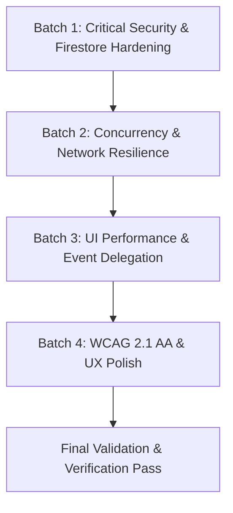

# Multi-Agent Implementation Tasks Specification
**Repository:** `tautos-bukiausias` (Lithuanian TV3 Parody Voting SPA)  
**Target:** Autonomous Multi-Agent Swarms & Cloud Auto-Agents  
**Design Standard:** `AGENTS.md` (Emil Kowalski, Anti-Slop, Karpathy Simplicity)

---

## Swarm Coordination Protocol



### Agent Execution Rules
1. **Zero Framework Regressions:** Retain pure Vanilla ES2022+ Native ES Modules (no bundler / build step).
2. **Surgical Diffs:** Touch only files assigned to the task. Preserve comments and Lithuanian humor copy.
3. **Verification Gate:** Run syntax and static checks after every task before proceeding to dependent tasks.
4. **Testing Protocol:** Validate with local preview server (`npx -y serve .`) and check browser console.

---

## Batch 1: Critical Security & Firestore Hardening
*Dependencies: None (First Priority)*

### Task 1.1: Firestore Rules & Deployment Lockdown
- **Target Files:** `firestore.rules`, `deploy-firebase.ps1`
- **Objective:** Eliminate wildcard open read/write access and prevent unauthorized database wipes or injection.
- **Implementation Steps:**
  1. Replace `match /{document=**} { allow read, write: if true; }` in `firestore.rules` with:
     - Default deny on all documents.
     - Scoped match on `/voting/state`.
     - Read allowed for all.
     - Write allowed ONLY if incoming data has exactly keys `['votes', 'customContestants', 'voterLedger', 'updatedAt']`, types match (`votes` is map, `customContestants` is list, `voterLedger` is list, `updatedAt` is int), and size limits are enforced (`voterLedger.size() <= 100`, `customContestants.size() <= 50`).
  2. In `deploy-firebase.ps1`, update deployment command from `--only hosting` to `--only hosting,firestore:rules`.
- **Validation Criteria:**
  - `firebase deploy --only firestore:rules` validates syntax without errors.
  - Writing unexpected keys or arbitrary paths is rejected by Firestore rules engine.

### Task 1.2: Eliminate Public Destructive Cloud Reset Button
- **Target Files:** `index.html`, `src/main.js`
- **Objective:** Prevent anonymous public visitors from triggering global cloud database resets.
- **Implementation Steps:**
  1. In `index.html` (line ~207), remove `<button type="button" id="resetDataBtn" class="btn-reset-text">Atstatyti duomenis</button>`.
  2. In `src/main.js` (lines 138–145), remove the `resetDataBtn` click listener and handler that calls `pushCloudState()`.
  3. Keep `resetAllData()` in `src/state/store.js` as an unexposed utility or attach it strictly to an opt-in console helper (e.g. `window.__TAUTOS_DEBUG__`) that does NOT write to production cloud.
- **Validation Criteria:**
  - No "Atstatyti duomenis" button visible in the footer.
  - No accidental cloud reset invocation from the UI.

### Task 1.3: Stored XSS Eradication & Input Sanitization
- **Target Files:** `src/ui/activity.js`, `src/ui/contestants.js`, `src/ui/leaderboard.js`, `src/ui/modal.js`
- **Objective:** Prevent HTML injection / XSS via user-submitted custom contestants, unescaped avatars, or voter names.
- **Implementation Steps:**
  1. In `src/ui/contestants.js`:
     - Wrap `c.avatar` with `escapeHTML(c.avatar)` at line 60.
     - Wrap `c.id` with `escapeHTML(c.id)` in `data-id="${escapeHTML(c.id)}"` at line 52.
  2. In `src/ui/leaderboard.js`:
     - Wrap `c.avatar` with `escapeHTML(c.avatar)` at line 65.
  3. In `src/ui/activity.js`:
     - Wrap `c.avatar` and the fallback candidate ID with `escapeHTML()` at line 34:
       `return '<span class="choice-chip">' + (c ? escapeHTML(c.avatar) + ' ' + escapeHTML(c.name) : escapeHTML(id)) + '</span>';`
  4. In `src/ui/modal.js`:
     - Define an allowed emoji whitelist: `const ALLOWED_EMOJIS = new Set(["🤡", "🥴", "🤓", "🤪", "🤠", "⚡"]);`.
     - In `handleAddContestantSubmit`, ensure `avatar` falls back to `"🤡"` if the value is not in `ALLOWED_EMOJIS`.
     - Truncate and sanitize inputs: `name` (max 40 chars), `alias` (max 40 chars), `tagline` (max 100 chars).
- **Validation Criteria:**
  - Injecting `` in candidate name, alias, avatar, or voter input renders strictly as escaped text.
  - No script execution occurs.

### Task 1.4: Security Headers, CSP & Gitignore Hardening
- **Target Files:** `firebase.json`, `.gitignore`
- **Objective:** Mitigate client script injection, prevent data leakage, and hide repository internals from public hosting.
- **Implementation Steps:**
  1. In `firebase.json`:
     - Add `Content-Security-Policy` header allowing scripts from `'self'` and `'https://www.gstatic.com'` and `'https://cdn.jsdelivr.net'`.
     - Add `X-Content-Type-Options: nosniff`, `X-Frame-Options: DENY`, `Referrer-Policy: strict-origin-when-cross-origin`.
     - Update `"ignore"` array to exclude `package.json`, `package-lock.json`, `skills-lock.json`, `firestore.rules`, `firestore.indexes.json`, `docs/**`, and `.git*`.
  2. In `.gitignore`:
     - Add `.env*`, `*.pem`, `*.key`, `*serviceAccount*.json`.
- **Validation Criteria:**
  - Running `npx firebase-tools hosting:channel:deploy` or inspecting response headers displays CSP and security headers.
  - Direct HTTP request to `/package.json` or `/firestore.rules` returns 404.

---

## Batch 2: Concurrency, State Integrity & Network Resilience
*Dependencies: Batch 1*

### Task 2.1: Robust State Merge Strategies & Dead State Cleanup
- **Target Files:** `src/state/store.js`, `src/services/api.js`
- **Objective:** Eliminate last-write-wins data loss during concurrent voting and remove unused re-render triggers.
- **Implementation Steps:**
  1. In `src/state/store.js`:
     - Remove `isSyncing` property from `state` and remove `setSyncing()` (or retain without notifying if not wired to a UI spinner) to eliminate 2 spurious re-renders per vote.
     - In `mergeCloudData(cloudData)`:
       - **Vote Counts:** Merge using `Math.max(state.votes[id] || 0, cloudData.votes[id] || 0)` so local votes in-flight are not erased by stale server snapshots.
       - **Voter Ledger:** Deduplicate entries by unique signature (`${voter}_${timestamp}_${choices.join(',')}`) before merging.
       - **Custom Contestants:** Validate that incoming items have `id`, `name`, `alias`, `tagline`, and `avatar` before pushing.
     - In `hydrateFromLocalStorage(fallback)`:
       - Retain `DEFAULT_CONTESTANTS` as the base; only restore `custom` contestants from local storage so codebase roster updates are never masked.
- **Validation Criteria:**
  - Simulated two-tab voting concurrently increments tallies without dropping votes.
  - Modifying code roster in `contestants.data.js` reflects immediately even with existing localStorage cache.

### Task 2.2: Resilient Dynamic SDK Import for Offline Fallback
- **Target Files:** `src/services/api.js`
- **Objective:** Prevent offline module evaluation crash when `gstatic.com` is unreachable.
- **Implementation Steps:**
  1. Convert static CDN imports in `src/services/api.js` to dynamic `import()` within `getFirestoreInstance()`.
  2. Wrap `await import("https://www.gstatic.com/...")` in a `try...catch` block.
  3. If the network is offline or the import fails, gracefully log a warning and let the application continue in offline localStorage fallback mode without halting `main.js`.
  4. Add `window.addEventListener("online", ...)` listener to re-attempt cloud connection and flush pending local state.
- **Validation Criteria:**
  - Disabling network in browser DevTools ("Offline" preset) and refreshing loads the app and renders cards from localStorage without module loading errors.

### Task 2.3: Deprecate Legacy REST Constants & Unused Exports
- **Target Files:** `src/config/constants.js`, `src/services/api.js`, `src/main.js`, `docs/agents/*.md`
- **Objective:** Eliminate dead REST API endpoints, unused polling intervals, and architectural inconsistencies.
- **Implementation Steps:**
  1. Remove `CLOUD_SYNC_URL` and `CLOUD_SYNC_INTERVAL_MS` from `src/config/constants.js`.
  2. In `src/main.js`, remove unused imports `CLOUD_SYNC_INTERVAL_MS` and `fetchCloudState`.
  3. In `src/services/api.js`, remove unused `fetchCloudState()` export.
  4. Update `docs/agents/conventions.md`, `docs/agents/security.md`, and `docs/agents/stack.md` to reference Firebase Firestore live sync instead of `api.restful-api.dev`.
- **Validation Criteria:**
  - Zero grep matches for `CLOUD_SYNC_URL` across active application code.

### Task 2.4: Vote Submission Rate-Limiting / Cooldown
- **Target Files:** `src/main.js`, `src/ui/dock.js`
- **Objective:** Mitigate rapid script-flooding and accidental double-submissions.
- **Implementation Steps:**
  1. In `src/main.js` `handleVoteSubmit()`:
     - Check a local cooldown timestamp in `sessionStorage` (e.g. 5-second voting throttle).
     - Disable `#submitVoteBtn` with visual feedback ("Balsuojama...") during push.
     - Re-enable button after completion.
- **Validation Criteria:**
  - Rapid double-clicking on submit button registers exactly one vote submission.

---

## Batch 3: UI Performance & Event Delegation
*Dependencies: Batch 2*

### Task 3.1: Event Delegation in Contestants Grid
- **Target Files:** `src/ui/contestants.js`
- **Objective:** Eliminate continuous teardown and rebinding of 28+ card event listeners on every re-render.
- **Implementation Steps:**
  1. Move card click and keyboard navigation listeners out of `renderContestants()`.
  2. Attach a single delegated listener to `#contestantsGrid`:
     ```javascript
     grid.addEventListener("click", (e) => {
       const card = e.target.closest(".contestant-card");
       if (card) {
         const id = card.getAttribute("data-id");
         if (id) handleCandidateToggle(id);
       }
     });
     grid.addEventListener("keydown", (e) => {
       if (e.key === "Enter" || e.key === " ") {
         const card = e.target.closest(".contestant-card");
         if (card) {
           e.preventDefault();
           const id = card.getAttribute("data-id");
           if (id) handleCandidateToggle(id);
         }
       }
     });
     ```
  3. Only attach the delegated listener once during grid initialization.
- **Validation Criteria:**
  - Clicking or pressing Enter/Space on any candidate card toggles selection properly.
  - Event listener count does not grow over repeated re-renders.

### Task 3.2: Search Input Debounce & Render Isolation
- **Target Files:** `src/main.js`, `src/ui/render.js`, `src/ui/leaderboard.js`
- **Objective:** Prevent full re-render cascades on every keystroke and isolate component concerns.
- **Implementation Steps:**
  1. In `src/main.js`:
     - Debounce `searchInput` listener with a 150ms timer before calling `setSearchQuery()`.
  2. In `src/ui/render.js`:
     - Only call `renderChart(state)` when `state.standingsView === "chart"`.
     - Only call `renderLeaderboard(state)` when `state.standingsView === "list"`.
  3. In `src/ui/leaderboard.js`:
     - Remove logic controlling chart container visibility and toggle buttons (lines 22–55).
     - Keep `renderLeaderboard()` strictly responsible for rendering its own list items.
- **Validation Criteria:**
  - Rapid typing in search bar causes only a single render pass 150ms after the last keypress.
  - Switching between Chart and List views does not trigger redundant offscreen Chart.js recalculations.

---

## Batch 4: WCAG 2.1 AA Accessibility & Design Polish
*Dependencies: Batch 3*

### Task 4.1: Semantic HTML Landmarks & Heading Hierarchy
- **Target Files:** `index.html`
- **Objective:** Meet WCAG 2.1 AA landmark and heading structural standards.
- **Implementation Steps:**
  1. Add `<a href="#main-content" class="sr-only">Praleisti į turinį</a>` as the first child of `<body>`.
  2. Wrap sections `#standingsSection`, `#votingSection`, and `#activitySection` inside `<main id="main-content">`.
  3. In `<section class="activity-section">`, replace `<h3 class="section-title">Paskutiniai balsai</h3>` with `<h2 class="section-title">Paskutiniai balsai</h2>`.
- **Validation Criteria:**
  - Screen reader landmark navigation detects `header`, `main`, and `footer`.
  - Heading outline is strictly sequential: `h1` -> `h2` -> `h3`.

### Task 4.2: Accessible Card Labels, Filter States & Form Controls
- **Target Files:** `src/ui/contestants.js`, `src/main.js`, `index.html`
- **Objective:** Ensure screen readers convey candidate satire, category filters, and mobile inputs.
- **Implementation Steps:**
  1. In `src/ui/contestants.js`:
     - Expand card `aria-label` to include alias and tagline:
       `aria-label="${escapeHTML(c.name)} (${escapeHTML(c.alias)}) – ${escapeHTML(c.tagline)}. ${voteLabel}"`
  2. In `src/main.js` and `index.html`:
     - Set initial `aria-pressed="true"` on the "Visi" filter pill, and `"false"` on others.
     - Update `aria-pressed` when switching category filter pills.
  3. In `index.html`:
     - Add `aria-label="Tavo vardas ar pravardė"` and `aria-required="true"` to `#voterNameInput`.
- **Validation Criteria:**
  - Screen reader speaks the full candidate name, nickname, satirical quote, and current vote tally upon focusing a card.
  - Filter pills announce pressed state.

### Task 4.3: Focus Contrast & Keyboard Trap Elimination
- **Target Files:** `styles/tokens.css`, `styles/components/contestants.css`, `styles/components/scroll-top.css`
- **Objective:** Provide accessible focus indicators (>3:1 contrast) and eliminate invisible focus traps.
- **Implementation Steps:**
  1. In `styles/components/contestants.css` and `styles/base.css`:
     - Replace weak 20% alpha focus shadows with `outline: 2px solid var(--color-gold); outline-offset: 2px;` on `:focus-visible`.
  2. In `styles/components/scroll-top.css`:
     - Add `visibility: hidden;` to `.scroll-to-top-btn` when not `.visible`, and `visibility: visible;` when `.visible`.
- **Validation Criteria:**
  - Tabbing through the page displays an unmistakable amber focus outline.
  - Keyboard focus never lands on the floating scroll button when the button is scrolled out of view.

### Task 4.4: Modal Focus Management & Disabled Card Feedback
- **Target Files:** `src/ui/modal.js`, `styles/components/contestants.css`, `src/ui/contestants.js`
- **Objective:** Implement accessible dialog trap/restore and preserve card feedback when limit is reached.
- **Implementation Steps:**
  1. In `src/ui/modal.js`:
     - Store previously focused element before opening modal.
     - Trap Tab key within modal elements while open.
     - Restore focus to `#openAddModalBtn` when closed.
  2. In `styles/components/contestants.css`:
     - Remove `pointer-events: none;` from `.contestant-card.disabled`.
  3. In `src/ui/contestants.js`:
     - Ensure clicking an unselected card when 3 candidates are already picked triggers `showToast("Daugiausiai galima pasirinkti 3 kandidatus!", "toast-error")`.
- **Validation Criteria:**
  - Opening modal traps focus; closing with Esc restores focus to trigger button.
  - Clicking a 4th candidate card triggers immediate toast guidance.

### Task 4.5: Emil Kowalski Tactile Polish & Mobile Safe Areas
- **Target Files:** `styles/components/modal.css`, `styles/components/dock.css`, `styles/responsive.css`, `styles/components/scroll-top.css`
- **Objective:** Deliver physical feedback on press and prevent UI clipping on mobile home bars.
- **Implementation Steps:**
  1. Add `:active { transform: scale(0.97); }` to `.modal-close-btn`, `.btn-modal-cancel`, `.btn-modal-submit`, and `.emoji-btn`.
  2. In `styles/components/dock.css` and `styles/responsive.css`:
     - Incorporate `env(safe-area-inset-bottom)`:
       `bottom: calc(12px + env(safe-area-inset-bottom, 0px));`
       `padding-bottom: max(12px, env(safe-area-inset-bottom, 0px));`
  3. In `styles/responsive.css`:
     - Keep `#scrollToTopBtn` at `width: 44px; height: 44px;` (WCAG target size).
- **Validation Criteria:**
  - Buttons depress visibly on tap/click.
  - Floating dock does not overlap iPhone/Android bottom navigation gesture bars.

### Task 4.6: Chart.js Reduced-Motion Compliance
- **Target Files:** `src/ui/chart.js`
- **Objective:** Honor user preference for reduced motion in canvas charts.
- **Implementation Steps:**
  1. In `src/ui/chart.js`:
     - Detect `const prefersReducedMotion = window.matchMedia("(prefers-reduced-motion: reduce)").matches;`.
     - Set Chart.js animation duration to `prefersReducedMotion ? 0 : 220`.
- **Validation Criteria:**
  - With "prefers-reduced-motion" enabled in OS or DevTools, chart renders instantly without bar growth animation.

### Task 4.7: Lithuanian Grammatical Pluralization
- **Target Files:** `src/utils/dom.js`, `src/ui/contestants.js`, `src/ui/chart.js`
- **Objective:** Fix grammatical errors where counts ending in 0 or teens rendered incorrect noun forms.
- **Implementation Steps:**
  1. In `src/utils/dom.js`, export helper:
     ```javascript
     export function formatVotesLt(count) {
       const n = Math.abs(Number(count) || 0);
       const mod10 = n % 10;
       const mod100 = n % 100;
       if (mod100 >= 11 && mod100 <= 19) return `${count} balsų`;
       if (mod10 === 1) return `${count} balsas`;
       if (mod10 >= 2 && mod10 <= 9) return `${count} balsai`;
       return `${count} balsų`;
     }
     ```
  2. Replace all occurrences of `count === 1 ? 'balsas' : 'balsai'` in `contestants.js` and `chart.js` with `formatVotesLt(count)`.
- **Validation Criteria:**
  - `0 balsų`, `1 balsas`, `4 balsai`, `10 balsų`, `11 balsų`, `20 balsų`, `21 balsas` render accurately.

---

## Validation & Quality Gates

Run these verification steps after completing each batch:
```bash
# 1. Check for any unexpected syntax or import errors
npx -y serve .

# 2. Verify git status and check for uncommitted secrets or build artifacts
git status
```
