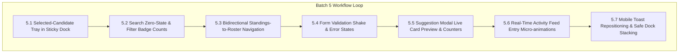

# Batch 5: High-Craft UI/UX Engineering & Interaction Polish
**Project:** `tautos-bukiausias` (Lithuanian TV3 Parody Voting SPA)  
**Standard:** Emil Kowalski Design Engineering, WCAG 2.2 AA, Anti-Slop Manifesto, Apple/Linear Craft  
**Status:** [x] Completed & Fully Verified (v1.4.0)

---

## 1. Executive Summary & Review

Following the successful completion and verification of Batches 1–4 (Security, Concurrency, Performance, and Baseline Accessibility), this specification establishes **Batch 5**: elevating the application from a functional voting prototype to a tier-one product experience.

Every suggestion is grounded in real interface patterns used by high-craft engineering teams (Linear, Apple, Vercel, Base UI) and strictly complies with the repository's **Zero AI Slop** mandate and **Emil Kowalski Design Engineering** guidelines.



---

## 2. Emil Kowalski UI/UX Review Audit Table

| Before | After | Why |
| :--- | :--- | :--- |
| Dock shows only counter `1 / 3 pasirinkta` | Dock displays an interactive tray of selected candidate chips with 1-click `✕` remove | Users who scroll down a long roster lose context of their choices and shouldn't have to hunt up and down to review or deselect |
| Search with no matches renders a blank white/black space (`grid.innerHTML = ""`) | Renders a styled empty state card with contextual copy and an "Išvalyti paiešką" button | Blank screens look broken; empty states must reassure the user and provide a 1-click recovery path |
| Filter pills show count only on "Visi (14)" | All filter pills display dynamic category counts (e.g. `Mokiniai (8)`, `Mokytojai (4)`) | Provides instant information scent before clicking; sets clear expectations for list length |
| Search input requires manual backspacing to clear | Inline `✕` clear button appears when text is entered, plus `/` keyboard focus shortcut | Standard high-craft search pattern; dramatically reduces friction on touch and desktop |
| Standings (Chart/Leaderboard) and Roster are completely disconnected | Clicking a candidate row in Leaderboard scrolls smoothly to their card with a subtle highlight pulse | Connects analytical results to voting action; users wanting to back a top contender can act immediately |
| Missing name on submit triggers toast only; input shows no change | Input receives `aria-invalid="true"`, red border accent, and a 160ms subtle horizontal shake | Direct spatial feedback where the error occurred is far more effective than peripheral toast alerts |
| Modal form requires blind entry without preview | Modal features a real-time live preview card reflecting inputs and selected avatar | Gives users immediate visual feedback and confidence before submitting custom entries |
| Modal tagline has a 100-character cap with no indicator | Subtle character counter (`X / 100`) updates on input with color shift near limit | Prevents unexpected input truncation and informs user of constraint |
| Real-time Firestore ledger updates abruptly replace the audit feed DOM | New ledger items enter with a subtle slide-down and warm amber highlight fade (1.2s) | Eliminates jarring visual layout jumps and communicates real-time dynamism |
| Toasts on mobile sit at `bottom: 24px`, directly covering the sticky action dock | On mobile viewports (< 640px), toasts render at `top: 16px` | Floating bottom toasts collide with sticky bottom action controls and virtual keyboards |

---

## 3. Detailed Implementation Tasks for Batch 5

### Task 5.1: Selected-Candidate Tray in Sticky Voting Dock
- **Files:** `src/ui/dock.js`, `styles/components/dock.css`, `index.html`
- **Objective:** Enable users to view, review, and remove their selected candidates directly inside or adjacent to the sticky voting dock without hunting through the grid.
- **Implementation:**
  1. In `src/ui/dock.js`, dynamically render a tray of selected contestant chips when `state.selectedCandidates.size > 0`.
  2. Each chip includes candidate avatar, short name, and an accessible remove button (`✕`) calling `toggleCandidateSelection(id)`.
  3. Include a subtle "Išvalyti visus" (Clear all) link when $\ge 1$ candidates are chosen.
  4. In `styles/components/dock.css`, style the tray with smooth enter/exit transitions (`transform: translateY(0)`, `opacity: 1`, duration `160ms var(--ease-out)`).
- **Validation Criteria:**
  - Selecting a candidate adds their chip to the dock immediately.
  - Clicking `✕` on a chip deselects them and updates the card state, counter, and dock.
  - Clearing all candidates resets the tray with zero layout glitch.

---

### Task 5.2: Search Zero-State & Dynamic Category Counts
- **Files:** `src/ui/contestants.js`, `styles/components/contestants.css`, `index.html`
- **Objective:** Provide a friendly empty state when search filters yield no results and display real-time counts on all filter pills.
- **Implementation:**
  1. In `src/ui/contestants.js`, if `filtered.length === 0`, render an empty state card:
     - Emoji/Icon: 🔍
     - Title: "Kandidatų nerasta"
     - Subtitle: "Pagal užklausą „{query}“ nieko neradome."
     - Button: `#clearSearchBtn` ("Išvalyti paiešką") which clears `#searchInput` and resets search state.
  2. In `src/ui/contestants.js` and `src/main.js`, add inline clear icon button inside `#searchInput` when text is non-empty.
  3. Dynamically compute and display counts for each category pill (`Visi (N)`, `Mokiniai (M)`, `Mokytojai (K)`, `Pasiūlyti (P)`).
- **Validation Criteria:**
  - Searching "xyz123" shows the empty state with reset button; clicking reset restores full roster.
  - Category counts accurately reflect default and custom contestants.

---

### Task 5.3: Bidirectional Standings-to-Roster Navigation
- **Files:** `src/ui/leaderboard.js`, `src/ui/chart.js`, `styles/components/contestants.css`
- **Objective:** Allow users to click or tap any contestant in the leaderboard or chart to smoothly jump to and highlight their voting card.
- **Implementation:**
  1. In `src/ui/leaderboard.js`, add `data-contestant-id="${c.id}"` to `.leaderboard-row` and style with cursor pointer and subtle hover elevation.
  2. On click, call `document.querySelector(`.contestant-card[data-id="${c.id}"]`)?.scrollIntoView({ behavior: 'smooth', block: 'center' })`.
  3. Temporarily add a `.card-pulse-highlight` class to the target card for 1200ms (`outline: 2px solid var(--color-gold); box-shadow: 0 0 16px rgba(245, 158, 11, 0.3)`).
  4. In `src/ui/chart.js`, configure Chart.js `onClick` callback to trigger the same scroll-and-highlight action.
- **Validation Criteria:**
  - Clicking any leaderboard row smoothly scrolls the page to the candidate card and flashes an amber highlight ring.
  - Respects `prefers-reduced-motion` (instant scroll if enabled).

---

### Task 5.4: Tactile Form Error Feedback & Input Shake
- **Files:** `src/main.js`, `styles/components/dock.css`, `styles/tokens.css`
- **Objective:** Provide instant, accessible visual feedback directly on the voter input field when submission validation fails.
- **Implementation:**
  1. In `src/main.js` (`handleVoteSubmit`), when `voterName` is invalid (< 2 chars):
     - Set `voterNameInput.setAttribute('aria-invalid', 'true')`.
     - Add `.input-error` class to `#voterNameInput`.
     - Trigger a 160ms CSS keyframe shake (`transform: translateX(-4px)` to `+4px`).
     - Remove error state immediately on input `input` event.
  2. In `styles/components/dock.css`, define `.voter-input.input-error` with border `--color-danger` and subtle red focus glow.
- **Validation Criteria:**
  - Attempting to submit without a name shakes the input, highlights it in red, sets `aria-invalid="true"`, and focuses the field.
  - Typing a single character removes the error outline.

---

### Task 5.5: Suggestion Modal Live Card Preview & Character Counter
- **Files:** `src/ui/modal.js`, `styles/components/modal.css`, `index.html`
- **Objective:** Give users total visual certainty of how their proposed candidate will look in the show roster before submitting.
- **Implementation:**
  1. In `index.html` (inside `#addContestantModal`), add a preview container `.modal-preview-wrapper` with a live `.contestant-card` mockup.
  2. In `src/ui/modal.js`, listen to `input` events on name, alias, tagline, and emoji clicks to update the preview card in real time with fallback placeholders.
  3. Add a live character counter under `#newCandidateTagline` (`<span id="taglineCharCount">0</span>/100`).
- **Validation Criteria:**
  - Typing into modal fields immediately updates the live preview card with accurate typography and styling.
  - Character counter updates dynamically and turns warning color when approaching limit (> 90 chars).

---

### Task 5.6: Real-Time Activity Feed Entry Micro-animations
- **Files:** `src/ui/activity.js`, `styles/components/activity.css`
- **Objective:** Smoothly introduce incoming real-time votes from other users without visual disruption.
- **Implementation:**
  1. Track previous top ledger timestamp / signature.
  2. For new incoming ledger entries, apply `.activity-item-new` with `@keyframes activitySlideIn` (opacity `0 -> 1`, `translateY(-6px -> 0)` over 200ms `var(--ease-out)`) and a subtle gold tint that fades out over 1.5s.
  3. Add relative timestamp formatting (e.g. "Ką tik", "Prieš 1 min.", "Prieš 5 min.") with tooltip showing exact time.
- **Validation Criteria:**
  - New votes entering via live Firestore sync animate in smoothly without jarring the audit log.
  - Reduced-motion users receive immediate render without motion transitions.

---

### Task 5.7: Mobile Toast Stacking & Safe-Area Protection
- **Files:** `styles/components/toast.css`, `src/ui/toast.js`
- **Objective:** Prevent toast notifications from obscuring the sticky voting dock or being pushed off-screen by virtual keyboards on mobile devices.
- **Implementation:**
  1. In `styles/components/toast.css`, use media query `@media (max-width: 640px)` to position `.toast-container` at `top: calc(16px + env(safe-area-inset-top, 0px))` centered horizontally (`left: 16px; right: 16px; align-items: center;`).
  2. Ensure enter animation on mobile slides down from `translateY(-8px) scale(0.96)` to `translateY(0) scale(1)`.
- **Validation Criteria:**
  - On mobile, toasts appear at the top of the viewport and never overlap the bottom voting dock.
  - On desktop, toasts remain in bottom-right corner.

---

## 4. Verification Gate Commands

Run this sequence after implementing tasks in Batch 5:
```bash
# 1. Static Syntax & Module Resolution Check
node --check src/main.js
node --check src/ui/dock.js
node --check src/ui/contestants.js
node --check src/ui/leaderboard.js
node --check src/ui/modal.js
node --check src/ui/activity.js

# 2. Local Preview Test Server
npx -y serve .

# 3. Git Status & Unintended Edits Verification
git status
```
